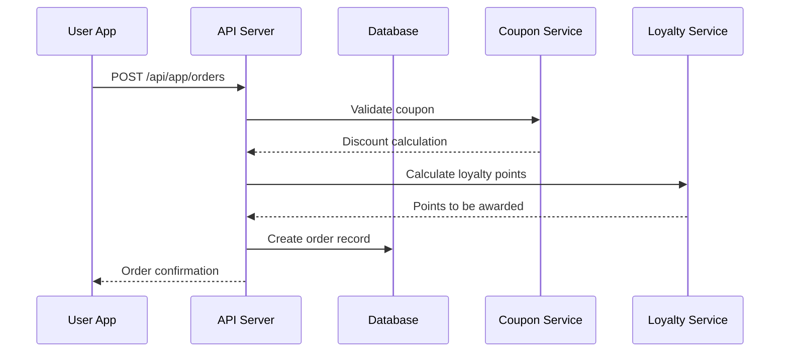
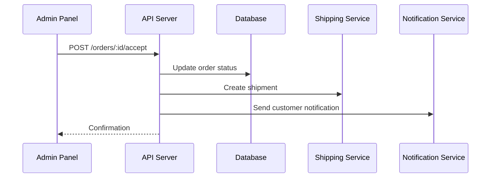
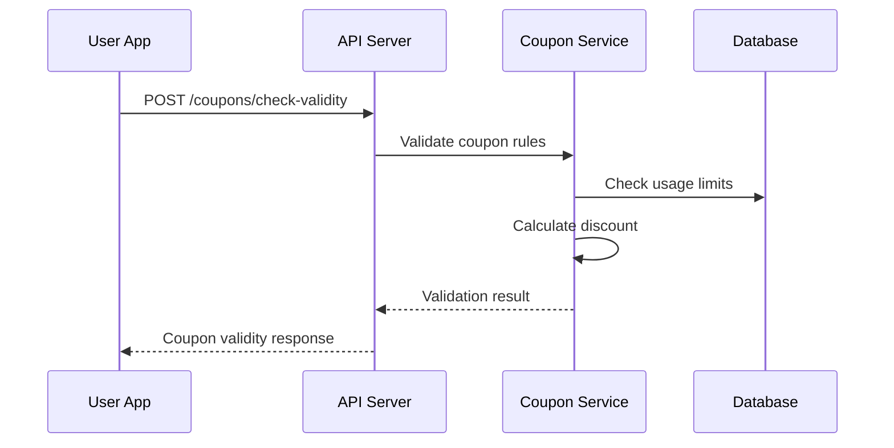

# 🛒 One Atta Backend - Complete Ordering System Workflow Documentation

This document provides a comprehensive overview of the ordering system workflow including shipment management, coupon system, and loyalty points integration.

## 📋 Table of Contents
- [System Overview](#system-overview)
- [User Workflow](#user-workflow)
- [Admin Workflow](#admin-workflow)
- [API Integration Points](#api-integration-points)
- [Data Flow Diagrams](#data-flow-diagrams)
- [Error Handling & Edge Cases](#error-handling--edge-cases)
- [Best Practices](#best-practices)

---

## 🎯 System Overview

The One Atta ordering system is a comprehensive e-commerce solution that handles:

### Core Components:
1. **Product & Blend Management** - Custom flour blends and ready products
2. **Coupon System** - Flexible discount management (fixed/percentage)
3. **Loyalty Points** - Customer rewards and retention program
4. **Order Management** - Complete order lifecycle from cart to delivery
5. **Shipping Integration** - Real-time shipping rates and tracking
6. **Payment Processing** - Multiple payment methods (COD, UPI, Card, Wallet)

### System Architecture:
```
User App ↔ API Gateway ↔ Business Logic ↔ Database
                ↓
            Admin Panel ↔ Order Management ↔ Shipping Service
```

---

## 👤 User Workflow

### 1. **Product Discovery & Cart Management**

#### 1.1 Browse Products
```
GET /api/app/products → View available products
GET /api/app/blends → View custom blends
GET /api/app/recipes → Discover recipe-based blends
```

#### 1.2 Add to Cart (Frontend State Management)
```javascript
// Local cart state structure
{
  items: [
    {
      item_type: "Product" | "Blend",
      item_id: "ObjectId",
      quantity: number,
      price_per_kg: number,
      total_price: number
    }
  ],
  subtotal: number,
  applied_coupon: null | couponObject,
  discount_amount: 0,
  final_total: number
}
```

### 2. **Checkout Process**

#### 2.1 Address Selection
```
GET /api/app/addresses → Fetch user addresses
POST /api/app/addresses → Add new address (if needed)
```

#### 2.2 Shipping Options
```
GET /api/app/shipping/check-serviceability?deliveryPincode=123456&weight=2
→ Check delivery availability

GET /api/app/shipping/shipping-rates?pickup=110001&delivery=400001&weight=2
→ Get shipping rates and delivery options
```

#### 2.3 Coupon Application (Optional)
```
GET /api/app/coupons/available
→ Fetch available coupons for user

POST /api/app/coupons/check-validity
{
  "coupon_code": "SAVE20",
  "order_amount": 500,
  "items": [...]
}
→ Real-time coupon validation

POST /api/app/coupons/validate
{
  "coupon_code": "SAVE20",
  "order_data": {
    "items": [...],
    "total_amount": 500
  }
}
→ Apply coupon and get final discount
```

#### 2.4 Loyalty Points (If Applicable)
```javascript
// Check available loyalty points
GET /api/app/profile/loyalty-points

// Points can be applied during order calculation
// 1 point = ₹1 discount (configurable via LoyaltySettings)
```

#### 2.5 Order Placement
```
POST /api/app/orders
{
  "items": [
    {
      "item_type": "Product",
      "item": "product_id",
      "quantity": 2,
      "price_per_kg": 150,
      "total_price": 300
    }
  ],
  "delivery_address": "address_id",
  "contact_numbers": ["+91-9876543210"],
  "payment_method": "COD",
  "subtotal": 500,
  "coupon_code": "SAVE20",
  "discount_amount": 100,
  "total_amount": 400
}
```

### 3. **Post-Order Activities**

#### 3.1 Order Tracking
```
GET /api/app/orders → View order history
GET /api/app/orders/:orderId → Get specific order details
GET /api/app/shipping/track/:shipmentId → Track shipment
```

#### 3.2 Loyalty Points Management
```
GET /api/app/coupons/history → View coupon usage history
GET /api/app/profile/loyalty-points → Check points balance
```

---

## 👨‍💼 Admin Workflow

### 1. **Order Management**

#### 1.1 Order Review Process
```
GET /api/admin/orders?status=pending
→ View all pending orders

GET /api/admin/orders/:orderId
→ Review specific order details including:
  - Customer information
  - Items ordered
  - Applied coupons
  - Payment method
  - Delivery address
```

#### 1.2 Order Processing Decisions

**Accept Order:**
```
POST /api/admin/orders/:orderId/accept
→ Automatically:
  - Updates order status to "accepted"
  - Creates shipment record
  - Triggers inventory deduction
  - Sends confirmation to customer
  - Awards loyalty points
```

**Reject Order:**
```
POST /api/admin/orders/:orderId/reject
{
  "rejection_reason": "Item out of stock"
}
→ Automatically:
  - Updates order status to "rejected"
  - Refunds coupon usage (if applicable)
  - Sends notification to customer
```

### 2. **Shipment Management**

#### 2.1 Shipment Preparation
```javascript
// After order acceptance, shipment is auto-created:
{
  "order_id": "order_id",
  "status": "preparing",
  "items": [...],
  "delivery_address": {...},
  "estimated_delivery": "date"
}
```

#### 2.2 Shipping Process
```
PUT /api/admin/shipping/:shipmentId/ship
{
  "courier_company": "Delhivery",
  "tracking_number": "DL123456789",
  "estimated_delivery": "2024-01-25"
}
→ Updates status to "shipped"
→ Sends tracking info to customer
```

#### 2.3 Delivery Confirmation
```
PUT /api/admin/shipping/:shipmentId/delivered
→ Updates status to "delivered"
→ Finalizes loyalty points credit
→ Marks order as completed
```

### 3. **Coupon Management**

#### 3.1 Campaign Creation
```
POST /api/admin/coupons
{
  "code": "NEWUSER20",
  "name": "New User Discount",
  "discount_type": "percentage",
  "discount_value": 20,
  "max_discount_amount": 200,
  "min_order_amount": 500,
  "usage_limit": 1000,
  "usage_limit_per_user": 1,
  "valid_from": "2024-01-01",
  "valid_until": "2024-01-31",
  "applicable_to": "all"
}
```

#### 3.2 Campaign Monitoring
```
GET /api/admin/coupons → View all coupons
GET /api/admin/coupons/:id/analytics → Usage statistics
PUT /api/admin/coupons/:id/toggle → Activate/Deactivate
```

### 4. **Loyalty Program Management**

#### 4.1 Configure Point Rules
```
PUT /api/admin/loyalty-settings
{
  "order_percentage": 2,    // 2% of order value as points
  "review_points": 50,      // Points for product reviews
  "share_points": 25,       // Points for sharing blends
  "point_value": 1,         // 1 point = ₹1
  "enable_order_rewards": true,
  "enable_blend_sharing": true,
  "enable_reviews": true
}
```

#### 4.2 Monitor Loyalty Activities
```
GET /api/admin/loyalty/transactions → View all point activities
GET /api/admin/loyalty/users → User loyalty overview
```

---

## 🔄 API Integration Points

### 1. **Order Creation Flow**


### 2. **Admin Order Processing**


### 3. **Coupon Validation Process**


---

## 📊 Data Flow Diagrams

### Order Lifecycle States
```
pending → accepted → processing → shipped → delivered
    ↓
  rejected (terminal state)
    ↓
cancelled (user action, before acceptance)
```

### Coupon Usage Flow
```
Available → Validated → Applied → Used → [Removed if order cancelled]
```

### Loyalty Points Flow
```
Order Placed → Order Delivered → Points Credited → Points Available for Use
```

---

## ⚠️ Error Handling & Edge Cases

### 1. **Coupon Edge Cases**

#### Invalid Coupon Scenarios:
- Expired coupon
- Usage limit exceeded
- Minimum order amount not met
- Coupon not applicable to cart items
- User already used coupon (per-user limit)

```javascript
// Error Response Format
{
  "success": false,
  "message": "Coupon validation failed",
  "errors": [
    {
      "field": "coupon_code",
      "message": "Coupon has expired",
      "code": "COUPON_EXPIRED"
    }
  ]
}
```

### 2. **Order Processing Edge Cases**

#### Inventory Issues:
- Product out of stock after order placement
- Partial availability of ordered items

```javascript
// Order Rejection Response
{
  "success": false,
  "message": "Order cannot be fulfilled",
  "data": {
    "rejection_reason": "Insufficient inventory for Product XYZ",
    "refund_status": "processed",
    "coupon_restored": true
  }
}
```

### 3. **Shipping Edge Cases**

#### Delivery Issues:
- Address not serviceable
- Weight restrictions
- Pin code validation failures

```javascript
// Shipping Error Response
{
  "success": false,
  "message": "Delivery not available",
  "data": {
    "error_code": "PINCODE_NOT_SERVICEABLE",
    "suggested_alternatives": [
      "Change delivery address",
      "Contact customer support"
    ]
  }
}
```

---

## 🎯 Best Practices

### 1. **For Frontend Integration**

#### Cart Management:
```javascript
// Always validate cart before checkout
const validateCart = async (cartItems) => {
  // Check product availability
  // Validate quantities
  // Recalculate prices
  // Verify coupon validity
};

// Real-time coupon validation
const validateCouponRealTime = debounce(async (couponCode, orderData) => {
  const response = await api.post('/coupons/check-validity', {
    coupon_code: couponCode,
    order_amount: orderData.total,
    items: orderData.items
  });
  return response.data;
}, 500);
```

#### Order Status Polling:
```javascript
// Poll for order updates
const pollOrderStatus = (orderId) => {
  const interval = setInterval(async () => {
    const order = await api.get(`/orders/${orderId}`);
    if (order.data.status === 'delivered') {
      clearInterval(interval);
      // Handle delivery completion
    }
  }, 30000); // Poll every 30 seconds
};
```

### 2. **For Backend Implementation**

#### Transaction Safety:
```javascript
// Use database transactions for critical operations
const processOrder = async (orderData) => {
  const session = await mongoose.startSession();
  session.startTransaction();
  
  try {
    // Create order
    const order = await Order.create([orderData], { session });
    
    // Update coupon usage
    if (orderData.coupon_code) {
      await Coupon.findOneAndUpdate(
        { code: orderData.coupon_code },
        { $inc: { used_count: 1 } },
        { session }
      );
    }
    
    // Update inventory
    await updateInventory(orderData.items, session);
    
    await session.commitTransaction();
    return order[0];
  } catch (error) {
    await session.abortTransaction();
    throw error;
  } finally {
    session.endSession();
  }
};
```

#### Coupon Validation Logic:
```javascript
const validateCoupon = async (couponCode, orderData, userId) => {
  const coupon = await Coupon.findOne({ 
    code: couponCode, 
    is_active: true 
  });
  
  if (!coupon) throw new Error('Invalid coupon code');
  
  // Check date validity
  const now = new Date();
  if (now < coupon.valid_from || now > coupon.valid_until) {
    throw new Error('Coupon has expired');
  }
  
  // Check usage limits
  if (coupon.usage_limit && coupon.used_count >= coupon.usage_limit) {
    throw new Error('Coupon usage limit exceeded');
  }
  
  // Check per-user usage
  const userUsage = await CouponUsage.countDocuments({
    coupon_id: coupon._id,
    user_id: userId
  });
  
  if (userUsage >= coupon.usage_limit_per_user) {
    throw new Error('User coupon limit exceeded');
  }
  
  // Check minimum order amount
  if (orderData.subtotal < coupon.min_order_amount) {
    throw new Error(`Minimum order amount is ₹${coupon.min_order_amount}`);
  }
  
  // Calculate discount
  return calculateDiscount(coupon, orderData);
};
```

### 3. **Performance Optimizations**

#### Database Indexing:
```javascript
// Essential indexes for performance
Order.index({ user_id: 1, status: 1 });
Order.index({ created_at: -1 });
Coupon.index({ code: 1, is_active: 1 });
CouponUsage.index({ user_id: 1, coupon_id: 1 });
UserLoyalty.index({ user: 1 });
```

#### Caching Strategy:
```javascript
// Cache frequently accessed data
const getCachedCoupons = async (userId) => {
  const cacheKey = `user_coupons:${userId}`;
  let coupons = await redis.get(cacheKey);
  
  if (!coupons) {
    coupons = await fetchAvailableCoupons(userId);
    await redis.setex(cacheKey, 300, JSON.stringify(coupons)); // 5 min cache
  }
  
  return JSON.parse(coupons);
};
```

---

## 📈 Monitoring & Analytics

### Key Metrics to Track:
1. **Order Conversion Rate**: Cart to order completion
2. **Coupon Usage Rate**: Percentage of orders using coupons
3. **Average Order Value**: With and without coupons
4. **Loyalty Engagement**: Points earned vs redeemed
5. **Shipping Performance**: Delivery times and success rates

### Recommended Dashboards:
1. **Real-time Order Dashboard**: Pending orders, processing times
2. **Coupon Performance**: Usage statistics, ROI analysis
3. **Customer Insights**: Loyalty points, purchase patterns
4. **Operational Metrics**: Inventory levels, shipping delays

---

This comprehensive workflow documentation provides a complete understanding of the One Atta ordering system. For specific API endpoint details, refer to the individual API documentation files in the DOCS directory.